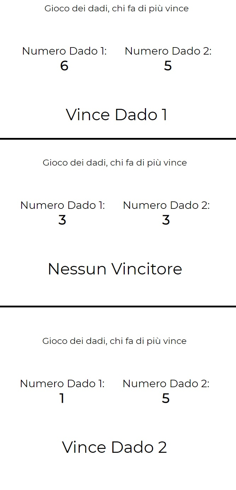

# Js-mail-dadi
This repository contains 2 JS exercises.  
* The first one asks the user the email and if it's contained in the array it prints 'you are in the list'  
* The second exercise is a game of dice, the computer generates 2 number and tells the user which dice one
***
### [Live Version exercise 1](https://gianluigivitale.github.io/js-mail-dadi/es1/)
(one of the right email is mario@rossi.it)
### [Live Version exercise 2](https://gianluigivitale.github.io/js-mail-dadi/es2/)
***

_Preview:_

